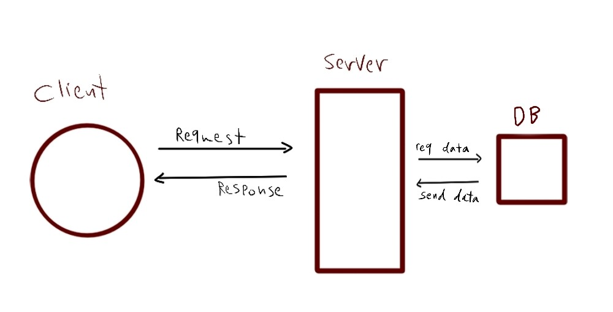

# Lab 03
## Express REST API
Author: Sham Al-Jalam

* deployed application : [https://api-server-5vp7.onrender.com](https://api-server-5vp7.onrender.com)

* Github actions: [https://github.com/ShamAhmad2022/api-server/actions](https://github.com/ShamAhmad2022/api-server/actions)

*  pull request: [https://github.com/ShamAhmad2022/api-server/pull/2](https://github.com/ShamAhmad2022/api-server/pull/2)

### Setup:
.env requirements:

PORT - 3000

### Running the app:
* npm start

* Endpoint: /

    * Returns Object
    ```Js
    {
        "code": 200,
        "message": "Welcome to Home page :)"
    }
    ```

* Endpoint: /music

    * Returns Object
    ```Js
    [
        {
            "id": 1,
            "name": "Little dark age",
            "author": "MGMT",
            "createdAt": "2023-06-19T19:51:51.817Z",
            "updatedAt": "2023-06-19T19:51:51.817Z"
        },
        {
            "id": 2,
            "name": "Runaway",
            "author": "Aurora",
            "createdAt": "2023-06-19T19:52:06.678Z",
            "updatedAt": "2023-06-19T19:52:06.678Z"
        }
    ]
    ```
* Endpoint: /game

    * Returns Object
    ```Js
    [
        {
            "id": 1,
            "name": "Resident Evil 4",
            "company": "Capcom",
            "createdAt": "2023-06-19T19:50:54.296Z",
            "updatedAt": "2023-06-19T19:50:54.296Z"
        },
        {
            "id": 2,
            "name": "Far cry 5",
            "company": "Ubisoft",
            "createdAt": "2023-06-19T19:51:09.228Z",
            "updatedAt": "2023-06-19T19:51:09.228Z"
        }
    ]
    ```

* Endpoint: /university

    * Returns Object
    ```Js
    [
        {
            "id": 1,
            "name": "Zaraa",
            "createdAt": "2023-06-21T18:49:41.828Z",
            "updatedAt": "2023-06-21T18:49:41.828Z"
        },
        {
            "id": 2,
            "name": "Balqaa",
            "createdAt": "2023-06-21T18:49:47.298Z",
            "updatedAt": "2023-06-21T18:49:47.298Z"
        }
    ]
    ```

* Endpoint: /department

    * Returns Object
    ```Js
    [
        {
            "id": 1,
            "name": "It",
            "universityID": 1,
            "createdAt": "2023-06-21T18:50:23.614Z",
            "updatedAt": "2023-06-21T18:50:23.614Z"
        },
        {
            "id": 2,
            "name": "art",
            "universityID": 1,
            "createdAt": "2023-06-21T18:50:32.099Z",
            "updatedAt": "2023-06-21T18:50:32.099Z"
        }
    ]
    ```


* server errors

    * Returns Object
    ```Js
    {
        "code": 500,
        "route": "/intentionalError",
        "query": {},
        "body": {
            "test": "test"
        },
        "message": "Server ERROR:some kind of error :("
    }
    ```

* not found pages:

    * Returns Object
    ```Js
    {
        "code": 404,
        "message": "Page not found :( ",
        "route": "/help"
    }
    ```

* The rest of the end points are:

**create new music** : /music

**edit a certain music** : /music/id

**delete certain music** : /music/id

**select certain music** : /music/id

**create new game** : /game

**edit a certain game** : /game/id

**delete certain game** : /game/id

**select certain game** : /game/id

**create new university** : /university

**edit a certain university** : /university/id

**delete certain university** : /university/id

**select certain university** : /university/id

**create new department** : /department

**edit a certain department** : /department/id

**delete certain department** : /department/id

**select certain department** : /department/id

### Test:
* Unit Test: npm test

### WRRC


### code review
* Who was your partner?
* What was your key takeaway?
* Share the link to your PR request.
* Share the link to their PR request.